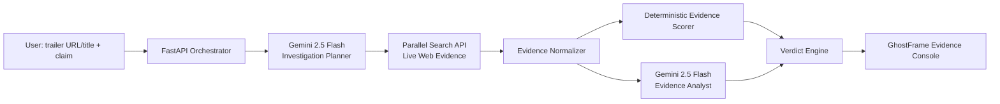

# GhostFrame Architecture



## Separation of responsibilities

### Gemini
- decomposes the claim into verification questions
- creates focused search queries
- synthesizes retrieved evidence
- explains contradictions and uncertainty

### Parallel
- performs live public-web retrieval at runtime
- returns source URLs, titles, and excerpts
- makes the evidence layer current and auditable

### Deterministic scoring
- does not allow the language model to invent the final confidence
- scores source quality and lexical support/contradiction signals
- keeps the final verdict reproducible

### UI
- shows the claim, investigation trace, evidence cards, verdict, and confidence
- never receives API keys

## Runtime request path
```
POST /api/verify
  -> Gemini planning
  -> Parallel live searches
  -> evidence normalization
  -> deterministic scoring
  -> Gemini synthesis
  -> verdict response
```

## Authentication
Gemini uses the Developer API key path only:
```python
from google import genai
import os

client = genai.Client(api_key=os.environ["GEMINI_API_KEY"])
```

No Vertex AI project/location initialization is used.
