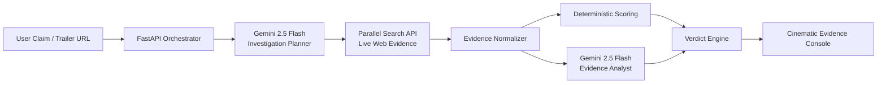

# GhostFrame Architecture

## Design principles
- Gemini reasons, but does not invent the score.
- Parallel provides live evidence.
- Python produces the final support/contradiction score.
- API keys never reach the browser.
- No Vertex AI authentication is required.
